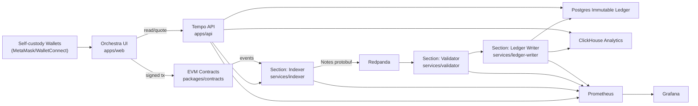

# mCryptoEx Phase 0 - Source Repo Audit and Architecture Mapping

Date: 2026-02-18

## 1) Phase 0 outcome

This document audits the two mandatory source repositories and defines a concrete port/refactor plan into `mcryptoex`.

- Audited source repos:
  - `stablecoin-mod`
  - `polyphony-ledger`
- Target repo:
  - `mcryptoex`
- Mandatory guardrails carried into plan:
  - Non-custodial only (wallet-signed user actions, no custody backend)
  - No compliance-evasion features
  - Optional compliance hooks only (geo-fencing/sanctions integration points)

## 2) Verified source repositories and notable structure

### 2.1 `stablecoin-mod` (audited paths)

- Smart contracts:
  - `stablecoin-mod/smart-contracts/StableToken.sol`
  - `stablecoin-mod/smart-contracts/Stabilizer.sol`
  - `stablecoin-mod/smart-contracts/scripts/deploy.js`
  - `stablecoin-mod/smart-contracts/hardhat.config.js`
- Backend (FastAPI):
  - `stablecoin-mod/backend/main.py`
  - `stablecoin-mod/backend/routers/mint.py`
  - `stablecoin-mod/backend/routers/burn.py`
  - `stablecoin-mod/backend/routers/reserve.py`
  - `stablecoin-mod/backend/models/reserve_model.py`
- Frontend (Next.js + Tailwind + wagmi):
  - `stablecoin-mod/frontend/pages/index.tsx`
  - `stablecoin-mod/frontend/pages/mint-burn.tsx`
  - `stablecoin-mod/frontend/pages/reserve.tsx`
  - `stablecoin-mod/frontend/pages/wallet.tsx`
  - `stablecoin-mod/frontend/components/Navbar.tsx`
  - `stablecoin-mod/frontend/components/WalletConnect.tsx`
  - `stablecoin-mod/frontend/pages/_app.tsx`
- Docs/config/scripts:
  - `stablecoin-mod/README.md`
  - `stablecoin-mod/docs/api-docs.md`
  - `stablecoin-mod/docs/whitepaper.md`
  - `stablecoin-mod/deploy/bnb-testnet-config.json`
  - `stablecoin-mod/scripts/price-oracle-bot.js`

### 2.2 `polyphony-ledger` (audited paths)

- Infra + compose:
  - `polyphony-ledger/docker-compose.yml`
  - `polyphony-ledger/docker-compose.tunnel.yml`
  - `polyphony-ledger/docker-compose.prod.yml`
  - `polyphony-ledger/.env.example`
- Streaming contracts (Protobuf):
  - `polyphony-ledger/proto/tx_raw.proto`
  - `polyphony-ledger/proto/tx_validated.proto`
  - `polyphony-ledger/proto/ledger_entry_batch.proto`
- Backend API/core:
  - `polyphony-ledger/backend/app/main.py`
  - `polyphony-ledger/backend/app/config.py`
  - `polyphony-ledger/backend/app/logging.py`
  - `polyphony-ledger/backend/app/metrics.py`
  - `polyphony-ledger/backend/app/tracing.py`
  - `polyphony-ledger/backend/app/websocket.py`
  - `polyphony-ledger/backend/app/authz.py`
- API routes:
  - `polyphony-ledger/backend/app/api/routes_tx.py`
  - `polyphony-ledger/backend/app/api/routes_ledger.py`
  - `polyphony-ledger/backend/app/api/routes_balances.py`
  - `polyphony-ledger/backend/app/api/routes_analytics.py`
  - `polyphony-ledger/backend/app/api/routes_replay.py`
  - `polyphony-ledger/backend/app/api/routes_observability.py`
  - `polyphony-ledger/backend/app/api/routes_governance.py`
- Pipeline services/workers:
  - `polyphony-ledger/backend/app/services/validate_tx.py`
  - `polyphony-ledger/backend/app/services/ledger.py`
  - `polyphony-ledger/backend/app/services/balances.py`
  - `polyphony-ledger/backend/app/services/governance.py`
  - `polyphony-ledger/backend/app/services/replay.py`
  - `polyphony-ledger/backend/app/kafka/topics.py`
  - `polyphony-ledger/backend/app/kafka/serde.py`
  - `polyphony-ledger/backend/app/kafka/producer.py`
  - `polyphony-ledger/backend/app/kafka/consumer_validator.py`
  - `polyphony-ledger/backend/app/kafka/consumer_ledger_writer.py`
  - `polyphony-ledger/backend/app/kafka/consumer_balance_projector.py`
  - `polyphony-ledger/backend/app/kafka/outbox_publisher.py`
  - `polyphony-ledger/backend/app/kafka/dlq.py`
  - `polyphony-ledger/backend/app/kafka/worker_metrics.py`
- Database and analytics:
  - `polyphony-ledger/backend/app/db/schema.sql`
  - `polyphony-ledger/backend/app/db/session.py`
  - `polyphony-ledger/backend/app/clickhouse/schema.sql`
  - `polyphony-ledger/backend/app/clickhouse/writer_consumer.py`
  - `polyphony-ledger/backend/app/clickhouse/queries.py`
- Observability assets:
  - `polyphony-ledger/infra/prometheus/prometheus.yml`
  - `polyphony-ledger/infra/otel/otel-collector.yml`
  - `polyphony-ledger/infra/grafana/datasources.yml`
  - `polyphony-ledger/infra/grafana/provisioning/dashboards.yml`
  - `polyphony-ledger/infra/grafana/dashboards/api_metrics.json`
  - `polyphony-ledger/infra/grafana/dashboards/ledger_kpis.json`
  - `polyphony-ledger/infra/grafana/dashboards/kafka_pipeline.json`
  - `polyphony-ledger/infra/grafana/dashboards/clickhouse_analytics.json`
  - `polyphony-ledger/infra/grafana/dashboards/tracing_overview.json`
- Frontend (realtime patterns):
  - `polyphony-ledger/frontend/src/lib/api.ts`
  - `polyphony-ledger/frontend/src/lib/ws.ts`
  - `polyphony-ledger/frontend/src/lib/telemetry.ts`
  - `polyphony-ledger/frontend/src/components/*`
  - `polyphony-ledger/frontend/src/app/dashboard/page.tsx`
  - `polyphony-ledger/frontend/src/app/transactions/page.tsx`
  - `polyphony-ledger/frontend/src/app/ledger/page.tsx`
  - `polyphony-ledger/frontend/src/app/analytics/page.tsx`
  - `polyphony-ledger/frontend/src/app/replay/page.tsx`
- CI and checks:
  - `polyphony-ledger/scripts/smoke_check.py`
  - `polyphony-ledger/scripts/e2e_pipeline_check.py`
  - `polyphony-ledger/.github/workflows/ci-e2e.yml`

## 3) Source analysis and delta plan

### 3.1 `stablecoin-mod`: what exists and what changes

#### Existing behavior

- `StableToken.sol`: owner-only mint/burn ERC20.
- `Stabilizer.sol`: oracle-triggered `adjustSupply` based on price delta to a fixed target.
- Backend endpoints are mostly mocked/simulated mint-burn flows.
- Frontend has basic wallet connect and mint/burn/reserve pages.

#### Risks/tech debt found

- No contract test suite in repo.
- `Stabilizer.sol` uses fragile algorithmic supply logic without robust risk controls.
- No on-chain circuit breakers, per-block mint caps, timelock administration, or pausability.
- Backend mint/burn endpoints return synthetic tx hashes (not chain-executed).
- Frontend uses placeholder addresses (`0x...`) and limited network handling.

#### Port decision for mCryptoEx

- Reuse as base and refactor heavily:
  - Reuse token/stabilizer concepts from:
    - `stablecoin-mod/smart-contracts/StableToken.sol`
    - `stablecoin-mod/smart-contracts/Stabilizer.sol`
- Replace logic for safety:
  - Replace fragile `adjustSupply` flow with guarded mint/burn policy, oracle sanity checks, pause/circuit breaker controls, and admin/timelock-ready roles.
- Reuse UI/API patterns only:
  - Reuse FastAPI + Next.js wiring patterns from stablecoin backend/frontend, but not mocked business logic.

### 3.2 `polyphony-ledger`: what exists and what changes

#### Existing behavior

- End-to-end streaming pipeline already implemented:
  - `tx_raw -> tx_validated -> ledger_entry_batches -> balance projections + ClickHouse`.
- Immutable double-entry ledger in Postgres.
- ClickHouse materialized views for volume/netflow/top-accounts.
- OTel + Prometheus + Grafana integrated.
- Replay tooling and smoke/e2e validation scripts exist.

#### Risks/tech debt found

- Domain model is payment-transfer centric, not DEX action centric.
- Topic names and protobuf contracts are generic to payments and need DEX schema design.
- Analytics views do not include gas cost, protocol fee attribution, pool-level or chain-level DEX metrics.
- Frontend is a generic ledger dashboard; not wallet swap/liquidity UX.

#### Port decision for mCryptoEx

- Vendor and adapt most pipeline modules.
- Keep architecture pattern and reliability primitives (idempotency, outbox, DLQ, replay).
- Refactor schemas/topics/routes to DEX semantics and musical naming.

## 4) Vendor vs submodule decision

Decision: **vendor code into `mcryptoex` (no git submodules)**.

Rationale:
- Deep refactor required across contracts, schema, topics, routes, and UI.
- Independent versioning and security patching in one production monorepo is simpler.
- CI and dependency management are easier without cross-repo submodule pin drift.

## 5) Old -> new module mapping

| Source module | Target path in `mcryptoex` | Action |
|---|---|---|
| `stablecoin-mod/smart-contracts/StableToken.sol` | `packages/contracts/contracts/musd/StableToken.sol` | Port + refactor |
| `stablecoin-mod/smart-contracts/Stabilizer.sol` | `packages/contracts/contracts/musd/Stabilizer.sol` | Port + redesign controls |
| `stablecoin-mod/smart-contracts/scripts/deploy.js` | `packages/contracts/scripts/deploy-movement2.ts` | Port + modernize |
| `stablecoin-mod/smart-contracts/hardhat.config.js` | `packages/contracts/hardhat.config.ts` | Port + multi-network config |
| `stablecoin-mod/backend/main.py` + routers | `apps/api/app/*` | Reuse structure only; replace mocked flows |
| `stablecoin-mod/frontend/pages/*` + components | `apps/web/app/*` and `packages/ui/*` | Reuse UX skeleton patterns |
| `polyphony-ledger/proto/*.proto` | `packages/proto/*.proto` | Fork + evolve to DEX Notes |
| `polyphony-ledger/backend/app/kafka/serde.py` | `services/indexer/src/serde.py` and `services/validator/src/serde.py` | Reuse with DEX message contracts |
| `polyphony-ledger/backend/app/kafka/consumer_validator.py` | `services/validator/src/main.py` | Adapt validation for DEX events |
| `polyphony-ledger/backend/app/kafka/consumer_ledger_writer.py` | `services/ledger-writer/src/main.py` | Adapt ledger entry generation |
| `polyphony-ledger/backend/app/kafka/outbox_publisher.py` | `services/ledger-writer/src/outbox_publisher.py` | Port largely unchanged |
| `polyphony-ledger/backend/app/kafka/consumer_balance_projector.py` | `services/ledger-writer/src/balance_projector.py` | Adapt account model for DEX accounting |
| `polyphony-ledger/backend/app/db/schema.sql` | `services/ledger-writer/db/schema.sql` | Port + DEX account dimensions |
| `polyphony-ledger/backend/app/clickhouse/schema.sql` | `services/ledger-writer/clickhouse/schema.sql` | Port + DEX metric MVs |
| `polyphony-ledger/backend/app/clickhouse/writer_consumer.py` | `services/ledger-writer/src/clickhouse_writer.py` | Port + DEX row mapping |
| `polyphony-ledger/backend/app/api/routes_analytics.py` | `apps/api/app/routes/analytics.py` | Port + DEX analytics |
| `polyphony-ledger/backend/app/api/routes_ledger.py` | `apps/api/app/routes/ledger.py` | Port + DEX ledger summaries |
| `polyphony-ledger/backend/app/tracing.py` + `metrics.py` + `logging.py` | `apps/api/app/observability/*` and `services/*/observability/*` | Port largely unchanged |
| `polyphony-ledger/infra/prometheus/*` | `infra/docker/prometheus/*` | Port |
| `polyphony-ledger/infra/otel/*` | `infra/docker/otel/*` | Port |
| `polyphony-ledger/infra/grafana/*` | `infra/docker/grafana/*` | Port + new dashboards |
| `polyphony-ledger/docker-compose*.yml` | `infra/docker/compose/*.yml` | Port + monorepo service names |
| `polyphony-ledger/scripts/smoke_check.py` | `scripts/smoke_check.py` | Port + DEX checks |
| `polyphony-ledger/scripts/e2e_pipeline_check.py` | `scripts/e2e_pipeline_check.py` | Port + swap/liquidity event checks |

## 6) Target movement architecture (Phase 0 baseline)

## 7) Phase-by-phase delta from audited sources

1. Movement 1 (Foundation)
- Scaffold monorepo folders and root tooling.
- Port infra stack from `polyphony-ledger` compose and observability configs.

2. Movement 2 (Contracts MVP)
- Import mUSD contracts from `stablecoin-mod` as base.
- Add robust controls and test suite.
- Implement Harmony Engine (AMM v2: Factory/Pair/Router) and event model for ledger ingestion.

3. Movement 3 (Tempo Pipeline)
- Fork protobuf contracts to DEX Notes (`swap`, `liquidity_add`, `liquidity_remove`, `musd_mint`, `musd_burn`, fee/gas events).
- Adapt validator/ledger-writer consumers and CH views for DEX accounting.

4. Movement 4 (Melody UI + Tempo API)
- Build `/overture`, `/harmony`, `/liquidity`, `/pools`, `/ledger`, `/analytics`.
- Add wallet-first execution and read-only mode.

5. Movement 5 (Hardening)
- Add security and incident docs, static analysis integration, and compliance hooks.

6. Movement 6 (Cross-chain adapters)
- Introduce EVM adapters and wrapped BTC/SOL trust-boundary documentation.

## 9) Movement 6 implementation notes

Implemented in `mcryptoex`:

- generated chain registry:
  - `scripts/generate_chain_registry.py`
  - output: `packages/sdk/data/chain-registry.generated.json`
- SDK adapter boundaries:
  - `packages/sdk/src/adapters/types.ts`
  - `packages/sdk/src/adapters/evm.ts`
  - `packages/sdk/src/adapters/btc.ts`
  - `packages/sdk/src/adapters/sol.ts`
- multi-chain indexer workers (compose):
  - `indexer-local` (`hardhat-local`)
  - `indexer-ethereum` (`ethereum-sepolia`)
  - `indexer-bnb` (`bnb-testnet`)
  - wired via `INDEXER_CHAIN_KEY` + `CHAIN_REGISTRY_PATH`
- API chain/risk endpoints:
  - `GET /tokens` (registry-backed)
  - `GET /risk/assumptions` (bridge/wrapped trust assumptions by chain)

## 8) Performance check for Phase 0

- Source repos audited with file-level provenance.
- Architecture mapping and port/refactor plan written in this file.
- Next movement can start from concrete reusable modules, not greenfield design.
